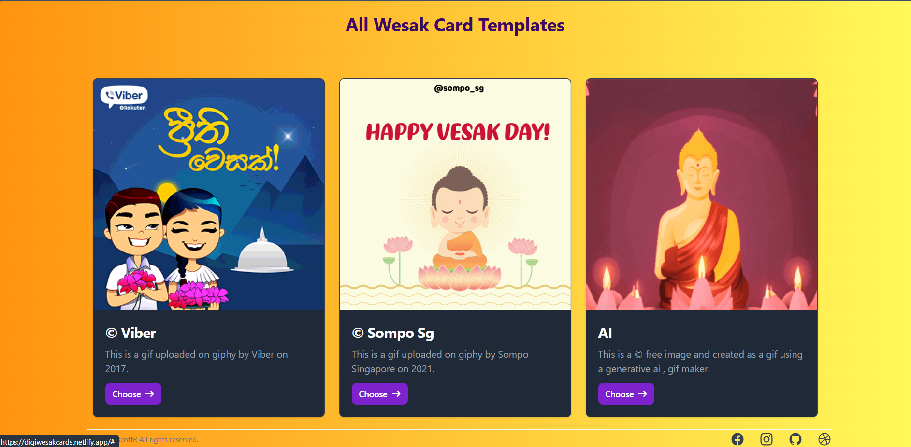
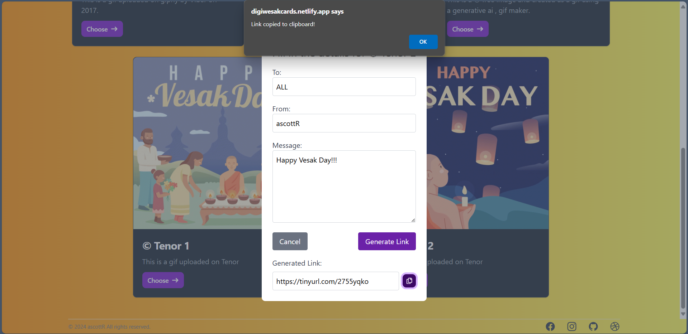
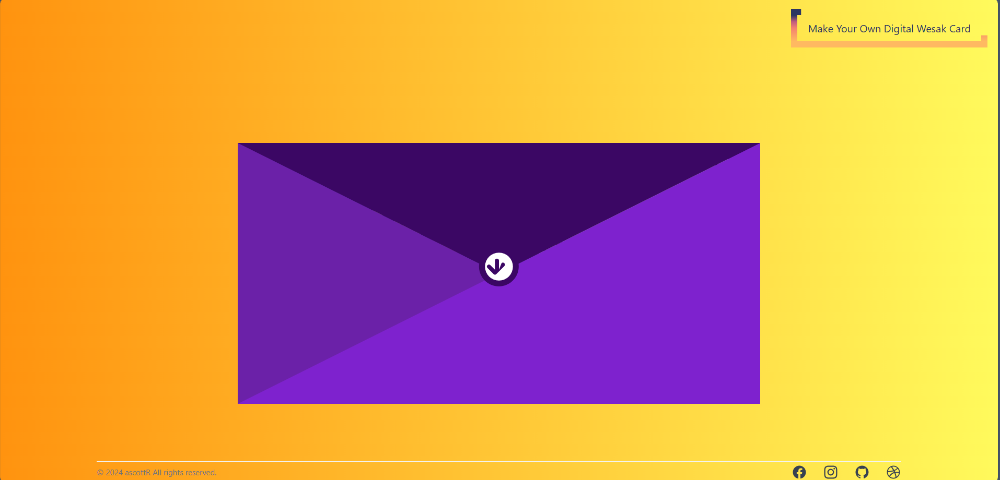
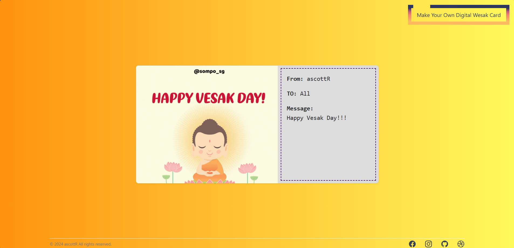

#  Digital Vesak Card Sharing App 

Welcome to the **Digital Vesak Card Sharing and Creation App**! This project is a simple yet meaningful web application that allows users to create and share Vesak greeting cards, digitizing a cherished childhood tradition.

## Table of Contents
- [Live Demo](#live-demo)
- [About the Project](#about-the-project)
- [Features](#features)
- [Technologies Used](#technologies-used)
- [Usage](#usage)
- [Screenshots](#screenshots)
- [Future Enhancements](#future-enhancements)
- [Contact](#contact)

## Live Demo

Check out the live demo of the app: [Digital Vesak Card Sharing App on Netlify](https://digiwesakcards.netlify.app/)

## About the Project

As children, many of us enjoyed exchanging Vesak greeting cards with friends, a tradition filled with joy and creativity. This app aims to digitize that experience, allowing users to create and share personalized Vesak greeting cards online. It's built using React for the frontend, with Tailwind CSS and custom CSS for styling. Additionally, the app leverages the TinyURL API to shorten links for shared cards, making them easy to share.

## Features

- **Pre-built Vesak Card Templates**: Choose from a variety of hard-coded dummy templates.
- **Customizable Cards**: Personalize your card by entering the recipient's name, writing a message, and selecting a card style.
- **Shareable Links**: Use the TinyURL API to generate shortened links for easy sharing.
- **Responsive Design**: Enjoy a seamless experience on both mobile and desktop devices.

## Technologies Used

- **React**: A JavaScript library for building user interfaces.
- **Tailwind CSS**: A utility-first CSS framework for styling.
- **Custom CSS**: Additional styling to enhance the design.
- **TinyURL API**: For shortening shared links.

## Usage

1. **Create a New Card**: Navigate through the app to create a new Vesak card.
2. **Select a Template**: Choose from the available pre-built card templates.
3. **Personalize the Card**: Enter the recipient's name, write a personalized message, and select a card style.
4. **Share the Card**: Copy the shortened link provided and share it with your friends.

## Screenshots

Here are some screenshots of the app:

### Home Page

### Card Creation Form

### Envelope

### Share Card Page

## Future Enhancements

This project is a work in progress. Here are some features planned for future releases:

- **Backend Integration**: Implement a backend for storing templates in a database.
- **Holiday Cards**: Add the ability to create and share cards for Christmas, New Year, Valentine's Day, and other holidays.
- **More Customization Options**: Offer more templates, fonts, colors, and design elements.
- **User Accounts**: Allow users to save and manage their created cards.
- **Social Media Sharing**: Enable direct sharing of cards on social media platforms.
- **User-Added Templates**: Allow users to add their own templates and display them within the app.

## Contact
Tehan Nimsitha - [Linkedin](https://www.linkedin.com/in/tehannimsitha/)

Project Link: [https://github.com/ascottR/digital-vesak-card](https://github.com/ascottR/digiWesak)

